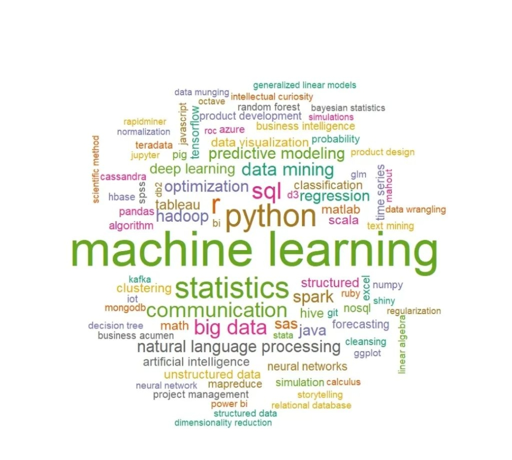

  <h1 align="center">Hii , I'm Anuj Vaghani</h1>
 
  

👨‍💻 Who am I?

<!--  <samp><b>I am in IT Engineering. In which I am a good MERN Full Stack Developer, Programming(C, Java, Python), machine learning, and data analytics, in which i am learning more.I’ve Always Sought Out Opportunities And Challenges That Are Meaningful To Me. Although My Professional Path Has Taken Many Twists And Turns I've Never Stopped Engaging My Passion To Help Others And Solve Problems.As Data Analytics, I Enjoy Using My Obsessive Attention To Detail, My Unequivocal Love For Making Things, And My Mission-Driven Work Ethic To Literally Change The World.</samp></b> -->
<!--      -->
- 👨🏻‍🎓 Currently persuing my B.Tech in IT
- 🤝 Seeking for help in Open Source Contributions 
- 🚀 To infinity and beyond !
- 🌱 I’m currently learning Machine learning + MERN Stack
- 👯 I’m looking to collaborate on Creative Projects
- 💬 Ask me about ...
- 😄 Pronouns: He/Him
- 📫 How to reach me: [Linkedin](https://www.linkedin.com/in/anuj-vaghani-3495b51b7)
- ☘️ community: [DEV.to](https://dev.to/anujvaghani0) & [StackOverflow](https://stackoverflow.com/users/18897554/anujvaghani0)
- 🥅 2022 Goals: Contribute more to Open Source projects
- 📝 [Resume](https://1drv.ms/b/s!AnsTV21m3GlEg7ALq6forUvrqaV77Q)
 
 
 
<h2 align="center">  Reach out to me on </h2>
<!-- **anujvaghani0/anujvaghani0** is a ✨ _special_ ✨ repository because its `README.md` (this file) appears on your GitHub profile. -->

<!--    -->
<!--   
   -->
 
 
 
 

 

<!-- ## My Skills 🎓 -->
<h2 align="center">  Technology Stack</h2>
<!--  -->

  
  
    
  
  
  
   
     
   
   
  
    
  
  
  
  
  
  
  

 <h2 align="center">Trophies</h2>

    

<!-- 

                                 

   -->
 

    
  

<!-- <h2 align="center">Tech Toolbox🧰</h2>

 

 -->
<h2 align="center"> My Github Stats</h2>

<!--  -->

<!-- Here are some ideas to get you started:

- 🔭 I’m currently working on ...
- 🌱 I’m currently learning ...
- 👯 I’m looking to collaborate on ...
- 🤔 I’m looking for help with ...
- 💬 Ask me about ...
- 📫 How to reach me: ...
- 😄 Pronouns: ...
- ⚡ Fun fact: ...
 -->
